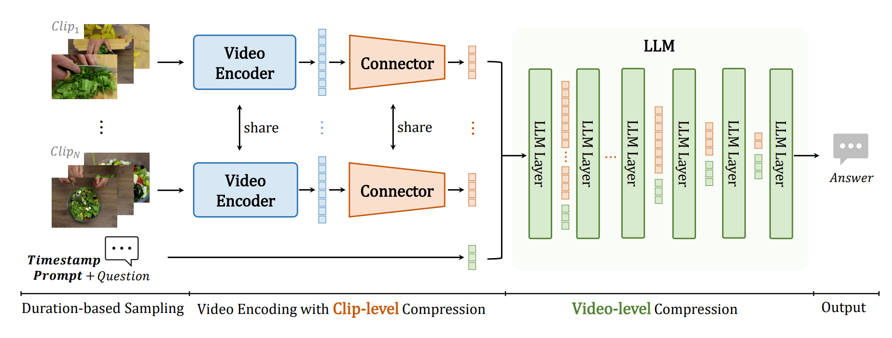

<div align="center">


<h2><a href="https://www.arxiv.org/abs/2501.00574">VideoChat-Flash: Hierarchical Compression for Long-Context Video Modeling</a></h2>

[Xinhao Li](https://scholar.google.com/citations?user=evR3uR0AAAAJ), [Yi Wang](https://scholar.google.com.hk/citations?user=Xm2M8UwAAAAJ), [Jiashuo Yu](https://scholar.google.com.hk/citations?user=iH0Aq0YAAAAJ&oi=ao), [Xiangyu Zeng](https://scholar.google.com/citations?user=jS13DXkAAAAJ&hl=zh-CN), Yuhan Zhu, Haian Huang, Jianfei Gao, [Kunchang Li](https://scholar.google.com/citations?user=D4tLSbsAAAAJ), [Yinan He](https://dblp.org/pid/93/7763.html), Chenting Wang, [Yu Qiao](https://scholar.google.com/citations?user=gFtI-8QAAAAJ&hl), [Yali Wang](https://scholar.google.com/citations?user=hD948dkAAAAJ), and [Limin Wang](https://scholar.google.com/citations?user=HEuN8PcAAAAJ)

<p align="center">
        🤗 <a href="https://huggingface.co/collections/OpenGVLab/videochat-flash-6781493748713b5ba2b705e0">Model & Data</a> &nbsp&nbsp ｜ &nbsp&nbsp🖥️ <a href="">Demo</a> &nbsp&nbsp | &nbsp&nbsp 📑 <a href="https://www.arxiv.org/abs/2501.00574">Paper</a> &nbsp&nbsp | &nbsp&nbsp 🌐 <a href="https://internvideo.github.io/blog/2024-12-31-VideoChat-Flash/">Blog</a>
<br>

</p>


</div>


## :fire: Updates
- [x] **2025/06/13**: 🎉🎉🎉Our model achieves promising results on the [VideoEval-Pro](https://arxiv.org/abs/2505.14640) benchmark focused on long video understanding!
- [x] **2025/05/10**:🔥🔥🔥 We release most video of our [training data](https://huggingface.co/datasets/OpenGVLab/VideoChat-Flash-Training-Data), Hope it can be of help to you!
- [x] **2025/03/27**:🔥🔥 We release our dataset and evaluation codes for single-hop and multi-hop needle-in-a-haystack!
- [x] **2025/03/09**:🔥🔥 We release our weights of each training stage [here](https://github.com/OpenGVLab/VideoChat-Flash/blob/main/llava-train_videochat/README.), try to build your VideoChat-Flash on them!
- [x] **2025/02/25**:🔥🔥 We release our [training data](https://huggingface.co/datasets/OpenGVLab/VideoChat-Flash-Training-Data), [training codes based LLaVA](llava-train_videochat) for VideoChat-Flash and [training codes based XTuner](xtuner-train_internvideo2_5) for finetuning InternVideo2.5.
- [x] **2025/02/12**: 🎉🎉🎉Our VideoChat-Flash-7B@448 has achieved first place on the latest Video Detail Caption Benchmark, [AuroraCap](https://rese1f.github.io/aurora-web/).
- [x] **2025/01/15**: We provide [evaluation codes](lmms-eval_videochat) for QA & Grounding Benchmark.
- [x] **2025/01/12**: 🔥🔥🔥Release **VideoChat2-Flash**, a powerfull MLLM built on video encoder ([InternVideo](https://github.com/OpenGVLab/InternVideo)) and LLM ([Qwen](https://github.com/QwenLM/Qwen)).
    - We offer five models, [VideoChat2-Flash-2B@224](https://huggingface.co/OpenGVLab/VideoChat-Flash-Qwen2_5-2B_res448) (Small LLM), [VideoChat2-Flash-7B@224](https://huggingface.co/OpenGVLab/VideoChat-Flash-Qwen2-7B_res224), [VideoChat2-Flash-7B@448](https://huggingface.co/OpenGVLab/VideoChat-Flash-Qwen2-7B_res448) (Overall best), [VideoChat-Flash-Qwen2_5-7B-1M](https://huggingface.co/OpenGVLab/VideoChat-Flash-Qwen2_5-7B-1M_res224) (Super long video input) and [VideoChat-Flash-Qwen2_5-7B_InternVideo2-1B](https://huggingface.co/OpenGVLab/VideoChat-Flash-Qwen2_5-7B_InternVideo2-1B) (Stronger short-term temporal understanding).
    <!-- - We provide [online demos]() and demo codes that can be run locally. -->

## 📑 Future Plan

- [ ] lmdeploy/vllm support for Videochat-Flash and InternVideo2.5
- [ ] LoRA finetuning training code for Videochat-Flash and InternVideo2.5
- [ ] Mixing image/video training code for InternVideo2.5
- [ ] Faster training code with XTuner for VideoChat-Flash

As I am currently very busy with work and find it difficult to complete the above plans quickly, I sincerely ask friends in the community to join in and **submit a PR**.

## :parrot: Introduction

**🚀State-of-the-art performance** in short and long video understanding, with temporal localization capabilities comparable to expert models.

**🔭Supports ultra-long video inputs**, achieving a groundbreaking needle-in-a-haystack evaluation accuracy of **99.1% on 10,000 frames**, capable of processing videos up to three hours long.

**⚡Highly efficient model architecture** with exceptional inference speed, encoding each video frame into just **16 tokens**, making it **5–10** times faster than the previous model.



## Demo & Inference

Refer to [hf README](https://huggingface.co/OpenGVLab/VideoChat-Flash-Qwen2_5-2B_res448) to inference our model.

## Evaluation


See [evaluation codes](lmms-eval_videochat). And [lmms-eval](https://github.com/EvolvingLMMs-Lab/lmms-eval) have supported our model, you also could use it to evaluate our model on varous benchmarks.

## Training


See [training codes based LLaVA](llava-train_videochat) for VideoChat-Flash and [training codes based XTuner](xtuner-train_internvideo2_5) for finetuning InternVideo2.5.


## :bar_chart: [NIAH](./BENCHMARK.md)


See [xtuner-eval_niah](xtuner-eval_niah) for evaluation of Single-Hop NIAH-Video and Multi-Hop NIAH-Video.

# :page_facing_up: Citation

If you find this project useful in your research, please consider cite:
```BibTeX
@article{li2024videochat,
  title={VideoChat-Flash: Hierarchical Compression for Long-Context Video Modeling},
  author={Li, Xinhao and Wang, Yi and Yu, Jiashuo and Zeng, Xiangyu and Zhu, Yuhan and Huang, Haian and Gao, Jianfei and Li, Kunchang and He, Yinan and Wang, Chenting and Qiao, Yu and Wang, Yali and Wang, Limin},
  journal={arXiv preprint arXiv:2501.00574},
  year={2024}
}
```

# :dizzy: Acknowledgement

Thanks to the open source of the following projects: [InternVideo](https://github.com/OpenGVLab/InternVideo), [UMT](https://github.com/OpenGVLab/unmasked_teacher), [Qwen](https://github.com/QwenLM/Qwen), [LLaVA-VL](https://github.com/LLaVA-VL/LLaVA-NeXT), [lmms-eval](https://github.com/EvolvingLMMs-Lab/lmms-eval), [Ask-Anything](https://github.com/OpenGVLab/Ask-Anything), [ToMe](https://github.com/facebookresearch/ToMe), [LongVLM](https://github.com/ziplab/LongVLM), [FastV](https://github.com/pkunlp-icler/FastV), [LLaVolta](https://github.com/Beckschen/LLaVolta), [PyramidDrop](https://github.com/Cooperx521/PyramidDrop), [LongVA](https://github.com/EvolvingLMMs-Lab/LongVA), their implementation provides valuable reference experience for our project.
